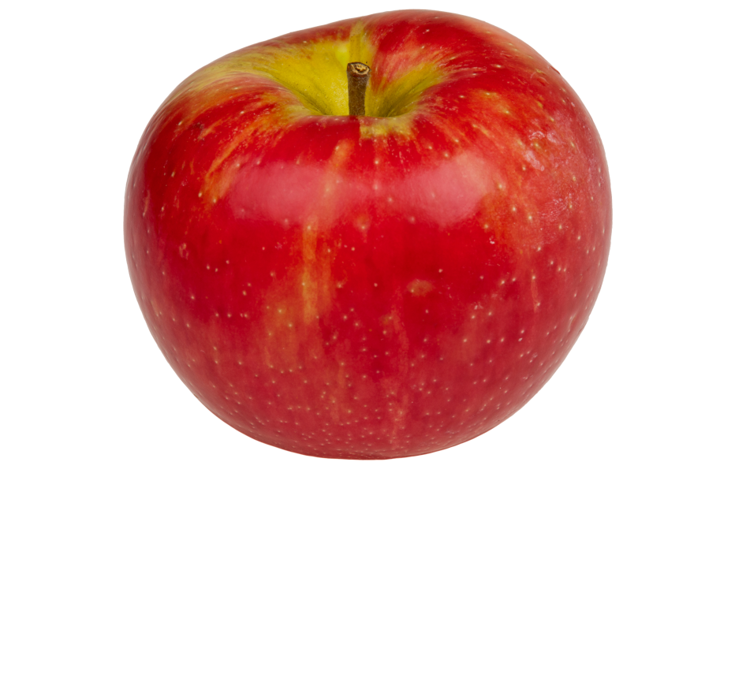
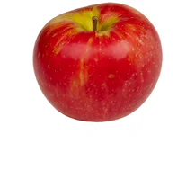

<div align="center">
<h1>GaINeR: Geometry-Aware Implicit Neural Representation for Image Editing</h1>
Weronika Jakubowska, Mikołaj Zieliński, Rafał Tobiasz, Krzysztof Byrski, Maciej Zięba, Dominik Belter, Przemysław Spurek
<br> <br>
  
[](https://wjakubowska.github.io/GaINeR/)
[](https://arxiv.org/pdf/2511.20924)
</div>

<p align="center">
  
</p>

**Hi there!**

This repository contains the official implementation assosciated with the paper GaINeR: Geometry-Aware Implicit Neural Representation for Image Editing.

**Project Page:** https://wjakubowska.github.io/GaINeR/


**Abstract:** Implicit Neural Representations (INRs) have become an essential tool for modeling continuous 2D images, enabling high-fidelity
reconstruction, super-resolution, and compression. Popular architectures such as SIREN, WIRE, and FINER demonstrate the potential
of INR for capturing fine-grained image details. However, traditional INRs often lack explicit geometric structure and have limited
capabilities for local editing or integration with physical simulation, restricting their applicability in dynamic or interactive settings.
To address these limitations, we propose GaINeR (Geometry-Aware Implicit Neural Representation for Image Editing), a novel framework for 2D images that combines trainable Gaussian distributions
with a neural network-based INR. For a given image coordinate, the model retrieves the K nearest Gaussians, aggregates distance-weighted embeddings,
and predicts the RGB value via a neural network. This design enables continuous image representation, interpretable geometric structure, and flexible local editing,
providing a foundation for physically aware and interactive image manipulation.

Feel free to check out this code if you just want to modify 2d images with ease!

<p align="center">
  
  
  
  
</p>


# ⚙️ Installation
### Docker (preferred way)
The easiest way to run our model is using the Docker container.
First, install [OptiX SDK 8.1.0](https://developer.nvidia.com/designworks/optix/downloads/legacy) in `gainer/knn` directory. 
Then simply run the command below, and everything will be set up for you automatically.
``` bash
# Build, run and enter the container
./docker/docker_run.sh
```

### Manual installation
This project is developed as an extension for Nerfstudio. To get started, please install [Nerfstudio](https://github.com/nerfstudio-project/nerfstudio/tree/2adcc380c6c846fe032b1fe55ad2c960e170a215) along with its dependencies. <br>

<p align="center">
    <!-- pypi-strip -->
    <picture>
    <source media="(prefers-color-scheme: dark)" srcset="https://docs.nerf.studio/_images/logo-dark.png">
    <source media="(prefers-color-scheme: light)" srcset="https://docs.nerf.studio/_images/logo.png">
    <!-- /pypi-strip -->
    
    <!-- pypi-strip -->
    </picture>
    <!-- /pypi-strip -->
</p>


Install [OptiX SDK 8.1.0](https://developer.nvidia.com/designworks/optix/downloads/legacy) in `gainer/knn` directory.
Then build the CUDA code by running:
``` bash
./build_optix.sh
```
> ⚠️ If the build fails, please double-check that the paths to the OptiX SDK and CUDA include directories are correct in build_optix.sh.
We have tested with OptiX 7.6 and 8.1.0. OptiX 9.0 is not supported at the moment.

Finally, install this repo with:
``` bash
pip install -e .
ns-install-cli
```
🚀 This will install the package in editable mode and kick off the Nerfstudio CLI installer to get you all set up and ready to go! 🎉

### Optional Installation
If you want to experiment 🧪 with different KNN algorithms you can install [Faiss](https://github.com/facebookresearch/faiss/tree/main). We found GPU acceleration wasn’t working out-of-the-box, so we had to compile Faiss from source with Python bindings for it to work properly. <br>

Also, uncomment the Faiss import and two KNN classes in `gainer/knn/knn_algorithms.py` to enable it. Then in `gainer_config.py` you can specify different KNN.

# Training, Editing & Rendering Workflow

Train a model on your input image:

```bash
ns-train gainer --data <path_to_image> --timestamp <experiment_name>
```

Render the trained model (If you’re rendering without editing, create a folder named camera_path inside your experiment directory, copy your trained point cloud file into it, and rename the file to 00000.ply):

```bash
gainer-render dataset \
    --load-config <path-to-config-file> \
    --output-path <path-to-output-folder> \
    --rendered-output-names rgb \
    --image-format png
```

# Gradio tool

To run masking and inpainting gradio tool just run
```bash
python3 gradio_mask.py
```

# taichi_elements simulation
You can run example simulation by training the `images/apple.png` image using the following: 

<p align="left">
  
</p>

```bash
ns-train gainer --data images/apple.png --experiment-name apple --timestamp 0 --pipeline.model.background-color white
```

and running the simulation script:

```bash
./simulation/run_sim.sh
```

As a result you should see `apple.mp4` in the project directory.

<p align="left">
  
</p>

Note: If you are running our model outside the Docker container make sure to first:

```bash
pip install git+https://github.com/taichi-dev/taichi_elements
```
